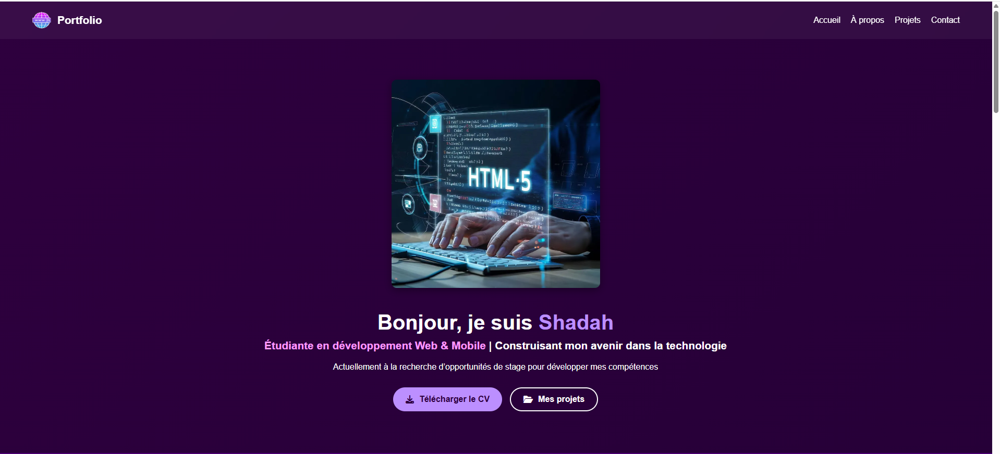

# Portfolio Web de Shadah HASSAN-ABDALLAH

[](https://developer.mozilla.org/fr/docs/Web/HTML) 
[](https://developer.mozilla.org/fr/docs/Web/CSS) 
[](https://developer.mozilla.org/fr/docs/Web/JavaScript)

---

## Aperçu du projet

  
*Exemple d'affichage sur desktop et mobile*

---

## Description

Ce projet est un **portfolio web personnel** réalisé avec HTML, CSS et un peu de JavaScript pour le menu burger responsive.  
Il présente mes projets, compétences et informations personnelles de manière moderne et interactive.

### Sections principales
- **Header & Navbar** : navigation fixe avec logo et liens vers les sections.  
- **Hero Section** : accueil avec présentation, image et boutons d’action.  
- **About Section** : description personnelle et professionnelle.  
- **Projects Section** : showcase des projets avec cartes interactives et effets hover.  
- **Responsive Design** : adaptation sur mobiles et tablettes avec menu burger.  

### Design
- Dégradés colorés modernes  
- Cartes floutées avec `backdrop-filter`  
- Animations légères pour améliorer l’expérience utilisateur  

---

## Installation / Utilisation

1. Cloner le projet :  
```bash
git clone https://github.com/S-HASSAN-ABDALLAH/PortoFolio


Structure du projet
/portfolio
│── index.html
│── /css
│   └── style.css
│── /images
│   └── logo.png
│── /js
│   └── script.js

Personnalisation

Modifier les couleurs et dégradés dans style.css

Ajouter ou retirer des projets dans la section "Projects" en modifiant le HTML

Remplacer les images par vos propres médias dans le dossier /images


Fonctionnalités principales

Menu burger pour les écrans mobiles

Effets hover sur les cartes de projets et les boutons

Responsive design pour toutes tailles d’écran

Sections animées et interactives


Auteur

Shadah HASSAN-ABDALLAH
✉️ shadah.hassan.abdallah@gmail.com

🔗 LinkedIn
 (https://linkedin.com/in/shadah-developpeuse)

